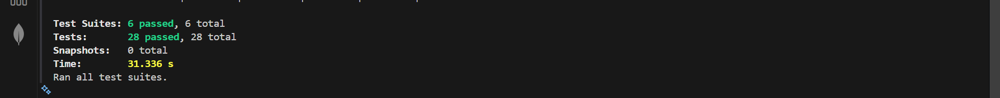

# NestJS User Management API

## Overview

This is a RESTful API built with **NestJS**, **TypeORM**, and **PostgreSQL** that implements a secure User Management system with full CRUD operations, JWT Authentication, and Role-Based Authorization.

The key security features implemented are:
1.  **Public Registration:** The POST /users route is public.
2.  **Authentication:** All sensitive routes require a valid JWT via the `AuthGuard`.
3.  **Authorization (RBAC):** The `RolesGuard` enforces permissions, restricting access to `findAll` and `DELETE` to users with the 'admin' role.
4.  **Ownership Check:** The `PATCH` and `DELETE` services enforce that a user can only modify or delete their *own* profile unless they are an 'admin'.

## Getting Started

### Prerequisites

You will need the following installed:
* [Node.js](https://nodejs.org/en) (v18+)
* [npm](https://www.npmjs.com/) (or yarn/pnpm)
* **PostgreSQL** (Installed locally or running via Docker)

### Installation and Setup

1.  **Clone the repository:**
    ```bash
    git clone <YOUR_REPOSITORY_URL>
    cd <PROJECT_NAME>
    ```

2.  **Install dependencies:**
    ```bash
    npm install
    ```

3.  **Configure Environment:**
    * Create a file named **`.env`** in the root directory.
    * Copy the content below and replace placeholders with your actual PostgreSQL credentials.

    ```env
    DB_HOST=localhost
    DB_PORT=5432
    DB_USERNAME=postgres
    DB_PASSWORD=<YOUR_DB_PASSWORD>
    DB_NAME=nest_assessment
    JWT_SECRET=superSecretKey123
    ```

4.  **Run the application:**
    ```bash
    # Runs in development mode with auto-reload
    npm run start:dev
    ```
    The API will be running at `http://localhost:3000`.

## API Endpoints and Testing

Use a tool like Postman to test the endpoints.

| Feature           | Method | Endpoint     | Required Role  | Notes                                                        |
|------------------|--------|--------------|----------------|--------------------------------------------------------------|
| Registration      | POST   | /users       | Public         | Body: `{ "email": "...", "password": "..." }`               |
| Login             | POST   | /auth/login  | Public         | Body: `{ "email": "...", "password": "..." }`               |
| Read All Users    | GET    | /users       | Admin          | Requires `Authorization: Bearer <token>` of an admin.       |
| Read One User     | GET    | /users/:id   | Authenticated  | Any valid token allowed.                                     |
| Update User       | PATCH  | /users/:id   | Authenticated  | Owner or Admin access enforced in service.                   |
| Delete User       | DELETE | /users/:id   | Authenticated  | Owner or Admin access enforced in service.                   |


### Testing Authorization (Critical Step)

1.  **Register a user:** This user's role will default to **'user'**.
2.  **Login** and get the token.
3.  **Verify Forbidden Access:** Try `GET /users` with the user token. It must return **`403 Forbidden`**.
4.  **Promote to Admin:** To test Admin routes, you must manually update the user's role in your database:
    ```sql
    UPDATE "user" SET role = 'admin' WHERE id = 'YOUR_USER_ID';
    ```
5.  **Relogin** to get a new token reflecting the 'admin' role.
6.  **Verify Admin Access:** Try `GET /users` with the new admin token. It must return **`200 OK`**.

## Testing and Code Coverage

The application includes robust unit tests written with Jest to cover all service logic, database interactions, and authorization checks.

### Running Tests

To execute the unit tests and generate the coverage report:

```bash
npm run test:cov
```

## Test Coverage



